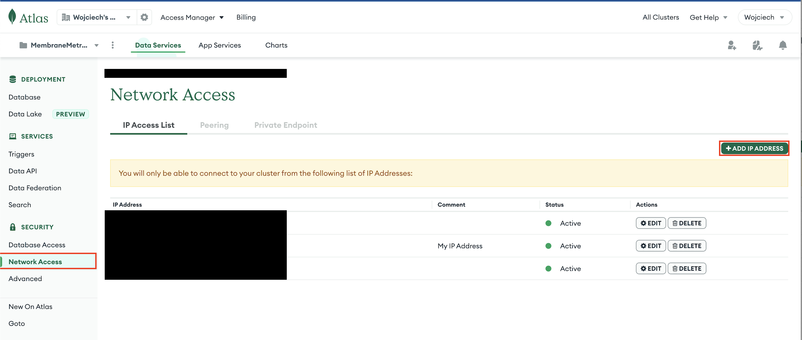

# Membrane Metrics

This repo contains the backend system for retrieving and logging into MongoDB some community metrics related to Membrane Framework.

## Deployment

1. Install packages listed in `requirements.txt` with `pip install -r requirements.txt`
2. Setup `config.toml` file in the project root directory with necessary configs specified in `config_example.toml`
3. If your DB host require IP addresses registration for connection, add your current IP address to `allowed IP addresses`. For `cloud.mongodb.com` with `Atlas DB` you can do this by entering `Network Access` page on `Security` section of you DB.

4. Add a cron job to run `python3 main.py` daily.
5. Deploy with gunicorn and Nginx - [example](https://www.digitalocean.com/community/tutorials/how-to-serve-flask-applications-with-gunicorn-and-nginx-on-ubuntu-22-04)
6. Generate certs with `certbot` (see example above)
